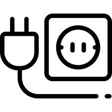
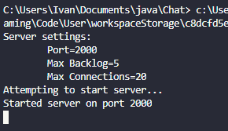
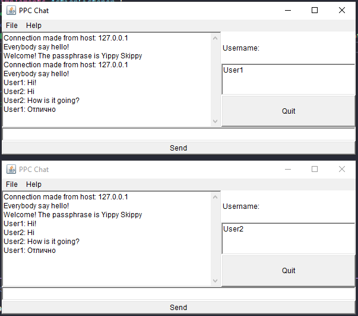
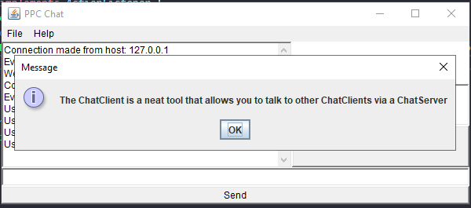

# Створення сокет-клієнта

## На "п'ять"

## Результат

Помилки під час запуску сервера відсутні

Чат з полем для вводу для імені користувача та підтримка кирилиці

Вікно About з використанням JOptionPane

---

 
